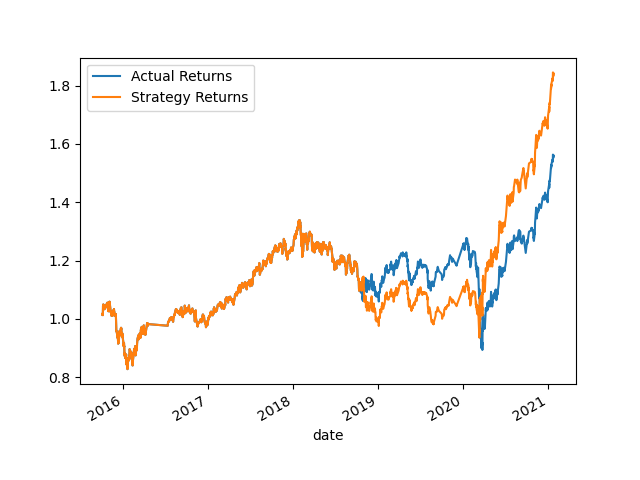
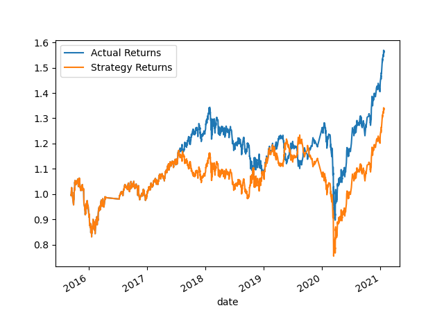
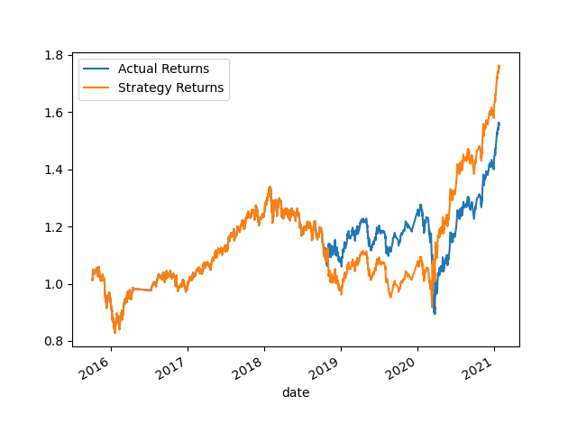

# Algo Trading 

## Cumulative returns for the original training data 

## Cumulative returns for the with 6 months training data 

## Cumulative returns for SMA 40 and 200 

> Please note that for the following chart, SMA short windows has been assigen to 40 and long windows has been assigned to 100. However, the time period of the training has been kept intact.

## Cumulative returns for optimized algorithm 

> For this approach, SMA short window and long window has been set to 5 and 100 respectively. Furthermore, the training time period has been changed to 6 months. By doing so, the performance of the algorithm could be improved significantly. 

## LogisticRegression classification returns 

> For this approach, LogisticRegression classification method has been used.  

