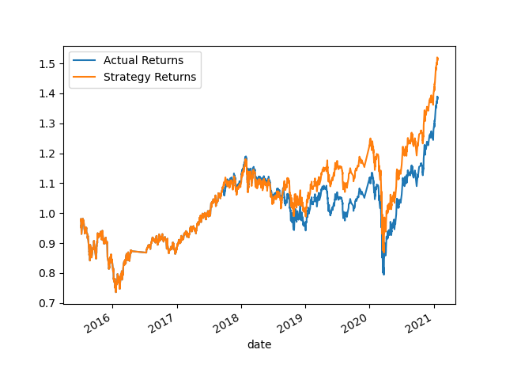

# Algo Trading

## Executive summary

This document analyzes feasible models for an algorithmic trading approach of emerging markets OHLCV. In the first section of the analysis, open the provided Jupyter notebook, restart the kernel, and then run the cells that correspond with the three steps: import the OHLCV dataset into a Pandas DataFrame, generate trading signals by using short- and long-window SMA values and split the data into training and testing datasets. After that the SVC model from the SKLearn support vector machine (SVM) learning method is used to fit the training data and make predictions based on the testing data. Review the predictions. The next step is to review the classification report that’s associated with the SVC model predictions. After that a predictions DataFrame that contains “Predicted”, “Actual Returns”, and “Strategy Returns” columns for the Dataframe haev been prepared. Next step is creating a cumulative return plot that shows the actual returns vs. the strategy returns. Save a PNG image of this plot. This will serve as a baseline against which to compare the effects of tuning the trading algorithm. After the charts has been ploted those charts has been exported as png files and saved under the Images directory.

## Cumulative returns for the original training data

## Cumulative returns for the with 6 months training data

According to the following diagram, it is clear that increasing the training data to get 6 months data can improve the performance of the algorithm.

## Cumulative returns for SMA 40 and 200

> Please note that for the following chart, SMA short windows has been assigen to 40 and long windows has been assigned to 100. However, the time period of the training has been kept intact. However, the performance of the algorithm has not been increased because of this change.

## Cumulative returns for optimized algorithm

> For this approach, SMA short window and long window has been set to 5 and 100 respectively. Furthermore, the training time period has been changed to 6 months. By doing so, the performance of the algorithm could be improved significantly.

## LogisticRegression classification returns

> For this approach, LogisticRegression classification method has been used.

## Conclustion

Did this new model perform better or worse than the provided baseline model?
Answer: No. The reason for this is after changing the classification model, the new model worked well until mid of 2020. However, after that the return of the new algo with LogisticRegression didn't work well.

Did this new model perform better or worse than your tuned trading algorithm?
Answer: No. It worked better than the tuned trading algorithm until the mid of 2020. Nevertheless, it starts to decline after that. So, the tuned algorithm is better than the new algo based on LogisticRegression.

Therefore, in conclusion, the tuned algorithm which has been trained for six months with 5 and 100 for short and long SMA window respectively, could be considered to be the best approach among these approaches
